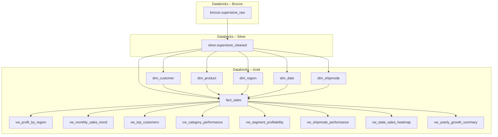

# Retail Sales Analytics & Forecasting — End-to-End Data Engineering Project

**Author:** Kalyan Reddy  
**Date:** 2025-11-04  

---

## 📘 Table of Contents
1. [Project Overview](#project-overview)  
2. [Architecture & Data Flow](#architecture--data-flow)  
3. [Data Lineage](#data-lineage)  
4. [Conceptual Data Mapping](#conceptual-data-mapping)  
5. [Gold Layer Models](#gold-layer-models)  
6. [ETL Summary](#etl-summary)  
7. [Power BI Analytics & Visualization](#power-bi-analytics--visualization)  
8. [Machine Learning & Forecasting](#machine-learning--forecasting)  
9. [Next Steps](#next-steps)  
10. [Notes](#notes)

---

## 🧩 Project Overview

Complete **end-to-end Retail Data Engineering & Forecasting pipeline** built on the [Superstore Dataset](https://www.kaggle.com/datasets/vivek468/superstore-dataset-final).

### 🎯 Goals
- Implement full **Medallion Architecture (Bronze → Silver → Gold)** in Databricks SQL + Delta  
- Model performance across **Regions, Products, Customers, and Time**  
- Create reusable **Analytical Views and Power BI dashboards**  
- Develop **ML forecasting for next-month sales**  
- Extend with **Gen-AI chatbot for business queries**

---

## 🧱 Architecture & Data Flow

| Layer | Platform | Description |
|-------|-----------|-------------|
| **Bronze** | Databricks | Raw ingestion from Volume (`Superstore.csv`) |
| **Silver** | Databricks | Cleansing, standardization, and type casting |
| **Gold** | Databricks SQL | Star Schema (dim/fact tables) + views |
| **BI** | Power BI | Executive dashboards |
| **AI** | Databricks ML + GenAI | Predictive modeling & chatbot |

---

## 🧭 Data Lineage



---

## 🧠 Conceptual Data Mapping

| Business Concept | Implemented As | Description |
|------------------|----------------|-------------|
| **Orders / Transactions** | `fact_sales` | Central sales fact table |
| **Customers** | `dim_customer` | Customer and segment details |
| **Products** | `dim_product` | Category and sub-category hierarchy |
| **Regions & States** | `dim_region` | Regional and state attributes |
| **Dates** | `dim_date` | Calendar dimension for time analysis |
| **Shipping** | `dim_shipmode` | Shipment mode classification |

---

## 🧱 Gold Layer Models

| Type | Model | Description |
|------|--------|-------------|
| **Dimension** | `dim_customer` | Customer and segment details |
| **Dimension** | `dim_product` | Product hierarchy |
| **Dimension** | `dim_region` | Region / State / City mapping |
| **Dimension** | `dim_date` | Calendar attributes |
| **Dimension** | `dim_shipmode` | Shipping types |
| **Fact** | `fact_sales` | Central sales transactions |
| **View** | `vw_profit_by_region` | Profit & sales by region |
| **View** | `vw_monthly_sales_trend` | Time-series trends |
| **View** | `vw_top_customers` | Top 10 customers |
| **View** | `vw_category_performance` | Category performance |
| **View** | `vw_segment_profitability` | Segment profitability |
| **View** | `vw_shipmode_performance` | Shipping performance |
| **View** | `vw_state_sales_heatmap` | Geographic sales heatmap |
| **View** | `vw_yearly_growth_summary` | YoY growth summary |

---

## ⚙️ ETL Summary

| Step | Task | Tools |
|------|------|-------|
| **1. Ingestion** | Read CSV → Delta | Databricks SQL (`read_files`) |
| **2. Cleansing** | `TRY_CAST`, `TRIM`, `INITCAP` | SQL Transform |
| **3. Modeling** | Star schema (ROW_NUMBER) | Databricks SQL |
| **4. Validation** | Row counts Bronze→Silver→Gold | SQL Checks |
| **5. Views** | BI-ready aggregations | Databricks SQL |
| **6. Visualization** | Power BI dashboards | Power BI |
| **7. Forecasting** | ML regression model | Databricks ML |

---

## 📊 Power BI Analytics & Visualization


---

## 🤖 Machine Learning & Forecasting

### 🎯 Objective
Predict next-month sales trends and drivers of profitability.

## 📊 Power BI Analytics & Visualization — How I Designed My Dashboards

| **Page** | **Purpose / Insights Delivered** | **Key Visuals & Custom Features (Designed by Me)** |
|-----------|----------------------------------|----------------------------------------------------|
| 🏠 **Home Summary / Executive Overview** | Centralized KPI view providing a snapshot of overall business health — Total Sales, Profit, Quantity, and Avg Profit Margin. Built with dynamic filters to drill into specific regions or categories. | KPI Cards (Total Sales, Profit, Quantity, Margin %), Multi-row Cards, Region & Category Slicers, Dynamic Bookmarks for Quick Navigation |
| 🌍 **Regional Insights / Geographical Performance** | Evaluate regional and state-level performance to identify top and low-performing areas. Used geo-visuals to track profit density and sales distribution. | Filled Map (Geo Heatmap using state boundaries), Stacked Bar Chart by Region, Tooltip Drill-through to State Performance Page, Region Filter Buttons |
| 📈 **Monthly Trends / Time Series Analysis** | Reveal sales and profit trends over time and compare YoY growth rates. Supports data-driven seasonal forecasting decisions. | Line Chart (Sales & Profit by Month), Area Chart for Cumulative Trend, Year Slicer, YOY Comparison Card, Dynamic Forecast Toggle |
| 📦 **Product Performance / Category Analytics** | Analyze category and sub-category profitability to spot top and bottom performers and understand discount impacts. | TreeMap (Category → Sub-Category), Profit vs Discount Scatter Plot, Category Filter Dropdown, Conditional Formatting for Low Margins |
| 🧍‍♂️ **Customer Insights / Segment Analysis** | Identify top customers, segment profitability, and spending patterns to optimize retention strategies. | Top 10 Customers Bar Chart (using RANKX), Customer Segment Pie Chart, Dynamic Table with Profit Margin % and Sales per Customer, Cross-highlight Interactions |
| 🚚 **Shipping Efficiency / Operational Insights** | Monitor shipping modes and logistics performance to measure delivery efficiency and profit impacts. | Clustered Column Chart (Sales vs Profit by Ship Mode), Delivery Days KPI Card, Shipping Cost vs Profit Scatter, Ship Mode Filter |
| 🔮 **Forecasting & Predictive Analysis** | Predict future sales and profit using time-series models integrated with the Databricks forecasting pipeline. Supports data-driven target planning. | Line Chart with Prophet Forecast & Confidence Intervals, Trend Indicator Cards (↑ / ↓), Toggle for Historical vs Forecast View, Power BI–Python Integration |

---


## 🧭 Executive Overview


## 🌍 Regional Performance


## 📈 Time Series / Trends


## 🧍‍♂️ Customer Insights


## 📦 Product Performance


## 🚚 Shipping Efficiency


---

## 💡 Insights
- **West & Central** regions dominate sales volume but with lower margins.  
- **Technology category** drives highest profit ratio (~22%).  
- **Corporate segment** shows best repeat purchase rate.  
- Clear **Q4 seasonality** trend in sales.  
- **Standard Class** shipping = high volume, low profit.

---

## 🔮 Next Steps
1. Integrate **Gen-AI chatbot** for natural-language queries.  
2. Extend ML to **multi-step time-series forecasting (Prophet/XGBoost)**.  
3. Automate ETL with **Databricks Workflows / Airflow**.  
4. Publish Power BI dashboard with scheduled refresh.

---

## 🧾 Notes
- Surrogate keys (`_sk`) via `ROW_NUMBER()`  
- `TRY_CAST` for safe type conversion  
- Kimball Star Schema adopted for dim/fact modeling  
- `NULLIF` used to avoid divide-by-zero in margins  
- Delta Lake provides ACID guarantees and incremental load

---

## 📂 Repository Structure
```
📂 Retail_Sales_Analytics_Forecasting/
├── databricks/
│   ├── bronze/
│   │   └── bronze_superstore_raw.sql
│   ├── silver/
│   │   └── silver_superstore_cleaned.sql
│   └── gold/
│       ├── gold_dimensions_facts.sql
│       ├── gold_views_analytics.sql
│       └── gold_validation_checks.sql
├── ml/
│   ├── sales_forecast_notebook.ipynb
│   └── model_evaluation_metrics.csv
├── powerbi/
│   ├── Retail_Sales_Analytics.pbix
│   └── assets/
│       ├── home_summary.png
│       ├── regional_performance.png
│       ├── customer_insights.png
│       ├── product_performance.png
│       ├── shipping_performance.png
│       └── sales_forecast.png
└── README.md
```

---

## 🚀 Summary
✅ Complete Retail Data Engineering pipeline in Databricks  
✅ Medallion Architecture (Bronze → Silver → Gold)  
✅ Power BI Dashboards for Executive & Regional Insights  
✅ ML Forecasting for Next-Month Sales  
✅ Future-Ready for Gen-AI Analytics Integration

