# Retail Sales Analytics & Forecasting — End-to-End Data Engineering Project

**Author:** Kalyan Reddy  
**Date:** 2025-11-04  

---

## 📘 Table of Contents
1. [Project Overview](#project-overview)  
2. [Architecture & Data Flow](#architecture--data-flow)  
3. [Data Lineage](#data-lineage)  
4. [Conceptual Data Mapping](#conceptual-data-mapping)  
5. [Gold Layer Models](#gold-layer-models)  
6. [ETL Summary](#etl-summary)  
7. [Power BI Analytics & Visualization](#power-bi-analytics--visualization)  
8. [Machine Learning & Forecasting](#machine-learning--forecasting)  
9. [Next Steps](#next-steps)  
10. [Notes](#notes)

---

## 🧩 Project Overview

Complete **end-to-end Retail Data Engineering & Forecasting pipeline** built on the [Superstore Dataset](https://www.kaggle.com/datasets/vivek468/superstore-dataset-final).

### 🎯 Goals
- Implement full **Medallion Architecture (Bronze → Silver → Gold)** in Databricks SQL + Delta  
- Model performance across **Regions, Products, Customers, and Time**  
- Create reusable **Analytical Views and Power BI dashboards**  
- Develop **ML forecasting for next-month sales**  
- Extend with **Gen-AI chatbot for business queries**

---

## 🧱 Architecture & Data Flow

| Layer | Platform | Description |
|-------|-----------|-------------|
| **Bronze** | Databricks | Raw ingestion from Volume (`Superstore.csv`) |
| **Silver** | Databricks | Cleansing, standardization, and type casting |
| **Gold** | Databricks SQL | Star Schema (dim/fact tables) + views |
| **BI** | Power BI | Executive dashboards |
| **AI** | Databricks ML + GenAI | Predictive modeling & chatbot |

---

## 🧭 Data Lineage

```mermaid
graph TD
    subgraph Bronze Layer [Databricks – Bronze]
        bronze_superstore["bronze.superstore_raw"]
    end

    subgraph Silver Layer [Databricks – Silver]
        silver_superstore["silver.superstore_cleaned"]
    end

    subgraph Gold Layer [Databricks – Gold]
        dim_customer["dim_customer"]
        dim_product["dim_product"]
        dim_region["dim_region"]
        dim_date["dim_date"]
        dim_shipmode["dim_shipmode"]
        fact_sales["fact_sales"]
        vw_profit_by_region["vw_profit_by_region"]
        vw_monthly_sales_trend["vw_monthly_sales_trend"]
        vw_top_customers["vw_top_customers"]
        vw_category_performance["vw_category_performance"]
        vw_segment_profitability["vw_segment_profitability"]
        vw_shipmode_performance["vw_shipmode_performance"]
        vw_state_sales_heatmap["vw_state_sales_heatmap"]
        vw_yearly_growth_summary["vw_yearly_growth_summary"]
    end

    bronze_superstore --> silver_superstore
    silver_superstore --> dim_customer
    silver_superstore --> dim_product
    silver_superstore --> dim_region
    silver_superstore --> dim_date
    silver_superstore --> dim_shipmode
    silver_superstore --> fact_sales

    dim_customer --> fact_sales
    dim_product --> fact_sales
    dim_region --> fact_sales
    dim_date --> fact_sales
    dim_shipmode --> fact_sales

    fact_sales --> vw_profit_by_region
    fact_sales --> vw_monthly_sales_trend
    fact_sales --> vw_top_customers
    fact_sales --> vw_category_performance
    fact_sales --> vw_segment_profitability
    fact_sales --> vw_shipmode_performance
    fact_sales --> vw_state_sales_heatmap
    fact_sales --> vw_yearly_growth_summary
```

---

## 🧠 Conceptual Data Mapping

| Business Concept | Implemented As | Description |
|------------------|----------------|-------------|
| **Orders / Transactions** | `fact_sales` | Central sales fact table |
| **Customers** | `dim_customer` | Customer and segment details |
| **Products** | `dim_product` | Category and sub-category hierarchy |
| **Regions & States** | `dim_region` | Regional and state attributes |
| **Dates** | `dim_date` | Calendar dimension for time analysis |
| **Shipping** | `dim_shipmode` | Shipment mode classification |

---

## 🧱 Gold Layer Models

| Type | Model | Description |
|------|--------|-------------|
| **Dimension** | `dim_customer` | Customer and segment details |
| **Dimension** | `dim_product` | Product hierarchy |
| **Dimension** | `dim_region` | Region / State / City mapping |
| **Dimension** | `dim_date` | Calendar attributes |
| **Dimension** | `dim_shipmode` | Shipping types |
| **Fact** | `fact_sales` | Central sales transactions |
| **View** | `vw_profit_by_region` | Profit & sales by region |
| **View** | `vw_monthly_sales_trend` | Time-series trends |
| **View** | `vw_top_customers` | Top 10 customers |
| **View** | `vw_category_performance` | Category performance |
| **View** | `vw_segment_profitability` | Segment profitability |
| **View** | `vw_shipmode_performance` | Shipping performance |
| **View** | `vw_state_sales_heatmap` | Geographic sales heatmap |
| **View** | `vw_yearly_growth_summary` | YoY growth summary |

---

## ⚙️ ETL Summary

| Step | Task | Tools |
|------|------|-------|
| **1. Ingestion** | Read CSV → Delta | Databricks SQL (`read_files`) |
| **2. Cleansing** | `TRY_CAST`, `TRIM`, `INITCAP` | SQL Transform |
| **3. Modeling** | Star schema (ROW_NUMBER) | Databricks SQL |
| **4. Validation** | Row counts Bronze→Silver→Gold | SQL Checks |
| **5. Views** | BI-ready aggregations | Databricks SQL |
| **6. Visualization** | Power BI dashboards | Power BI |
| **7. Forecasting** | ML regression model | Databricks ML |

---

## 📊 Power BI Analytics & Visualization — How I Designed My Dashboards

| **Page** | **Purpose / Insights Delivered** | **Key Visuals & Custom Features (Designed by Me)** |
|-----------|----------------------------------|----------------------------------------------------|
| 🏠 **Home Summary / Executive Overview** | Centralized KPI view providing a snapshot of overall business health — Total Sales, Profit, Quantity, and Avg Profit Margin. Built with dynamic filters to drill into specific regions or categories. | KPI Cards (Total Sales, Profit, Quantity, Margin %), Multi-row Cards, Region & Category Slicers, Dynamic Bookmarks for Quick Navigation |
| 🌍 **Regional Insights / Geographical Performance** | Evaluate regional and state-level performance to identify top and low-performing areas. Used geo-visuals to track profit density and sales distribution. | Filled Map (Geo Heatmap using state boundaries), Stacked Bar Chart by Region, Tooltip Drill-through to State Performance Page, Region Filter Buttons |
| 📈 **Monthly Trends / Time Series Analysis** | Reveal sales and profit trends over time and compare YoY growth rates. Supports data-driven seasonal forecasting decisions. | Line Chart (Sales & Profit by Month), Area Chart for Cumulative Trend, Year Slicer, YOY Comparison Card, Dynamic Forecast Toggle |
| 📦 **Product Performance / Category Analytics** | Analyze category and sub-category profitability to spot top and bottom performers and understand discount impacts. | TreeMap (Category → Sub-Category), Profit vs Discount Scatter Plot, Category Filter Dropdown, Conditional Formatting for Low Margins |
| 🧍‍♂️ **Customer Insights / Segment Analysis** | Identify top customers, segment profitability, and spending patterns to optimize retention strategies. | Top 10 Customers Bar Chart (using RANKX), Customer Segment Pie Chart, Dynamic Table with Profit Margin % and Sales per Customer, Cross-highlight Interactions |
| 🚚 **Shipping Efficiency / Operational Insights** | Monitor shipping modes and logistics performance to measure delivery efficiency and profit impacts. | Clustered Column Chart (Sales vs Profit by Ship Mode), Delivery Days KPI Card, Shipping Cost vs Profit Scatter, Ship Mode Filter |
| 🔮 **Forecasting & Predictive Analysis** | Predict future sales and profit using time-series models integrated with the Databricks forecasting pipeline. Supports data-driven target planning. | Line Chart with Prophet Forecast & Confidence Intervals, Trend Indicator Cards (↑ / ↓), Toggle for Historical vs Forecast View, Power BI–Python Integration |

---

## 🧭 Executive Overview

## 🌍 Regional Performance

## 📈 Time Series / Trends

## 🧍‍♂️ Customer Insights

## 📦 Product Performance

## 🚚 Shipping Efficiency

--

### 🎯 Objective
Predict **next-month sales and profit trends** across regions, categories & segments — enabling data-driven inventory and marketing decisions.

---

### ⚙️ ML Pipeline Overview
| Step | Component | Description |
|------|------------|-------------|
| **1. Data Source** | Gold Layer (`vw_monthly_sales_trend`) | Aggregated monthly sales and profit data |
| **2. Data Prep** | PySpark / Pandas | Transform and aggregate features for modeling |
| **3. Feature Engineering** | Lag features, rolling averages | Capture trend and seasonality patterns |
| **4. Model** | Prophet (Time-Series Forecasting) | Predict future monthly sales and profit |
| **5. Metrics** | RMSE, MAPE, R² | Evaluate forecast accuracy |
| **6. Visualization** | Power BI Forecast Page | Display historical + predicted trends |

---

## 💬 Gen-AI Chatbot (Retail Insights Assistant)

### 🎯 Objective
Enable **natural-language data analysis** through a chatbot that connects **Databricks Gold-layer data** with **Grok-3 (xAI)** — allowing business users to ask intuitive questions like:  
> “Which region had the highest sales last quarter?” 
> “Predict next-month sales.” 
> “Who are our top 5 customers?”

---

### ⚙️ Architecture
| Layer | Tool / Library | Purpose |
|-------|----------------|----------|
| **Backend Data** | Databricks Gold Tables | Source of truth for sales + profit data |
| **Embeddings** | SentenceTransformer (`all-MiniLM-L6-v2`) | Converts text data into vector embeddings |
| **Vector Store** | FAISS | Stores and retrieves embeddings for semantic search |
| **Language Model** | Grok-3 (xAI API) | Generates context-aware analytical answers |
| **UI Layer** | Streamlit | User-friendly chatbot interface |
| **Integration** | Python + REST API | End-to-end connection between Databricks ↔ FAISS ↔ Grok |
---

📂 Retail_Sales_Analytics_Forecasting/
├── databricks/
│   ├── bronze/
│   │   └── bronze_superstore_raw.sql                # Raw data ingestion script
│   ├── silver/
│   │   └── silver_superstore_cleaned.sql            # Data cleansing and standardization
│   └── gold/
│       ├── gold_dimensions_facts.sql                # Star schema (dimension + fact tables)
│       ├── gold_views_analytics.sql                 # Analytical views for BI
│       └── gold_validation_checks.sql               # Row counts and ETL validation checks
│
├── ml/
│   ├── sales_forecast_notebook.ipynb                # Prophet-based time-series forecasting
│   ├── profit_classification_notebook.ipynb         # Logistic/Random Forest profit classifier
│   └── model_evaluation_metrics.csv                 # Evaluation metrics (RMSE, MAPE, Accuracy)
│
├── powerbi/
│   ├── Retail_Sales_Analytics.pbix                  # Power BI dashboard file
│   └── assets/
│       ├── home_summary.png                         # Executive overview page
│       ├── regional_performance.png                 # Region-wise sales heatmap
│       ├── customer_insights.png                    # Customer segmentation insights
│       ├── product_performance.png                  # Product category performance
│       ├── shipping_performance.png                 # Shipping mode efficiency
│       └── sales_forecast.png                       # Forecasting visual from ML Prophet
│
├── chatbot/
│   └── retail_sales_analytics_chatbot.py            # Streamlit + Grok-3 Gen-AI Chatbot app
│
└── README.md                                        # Project documentation and setup guide

